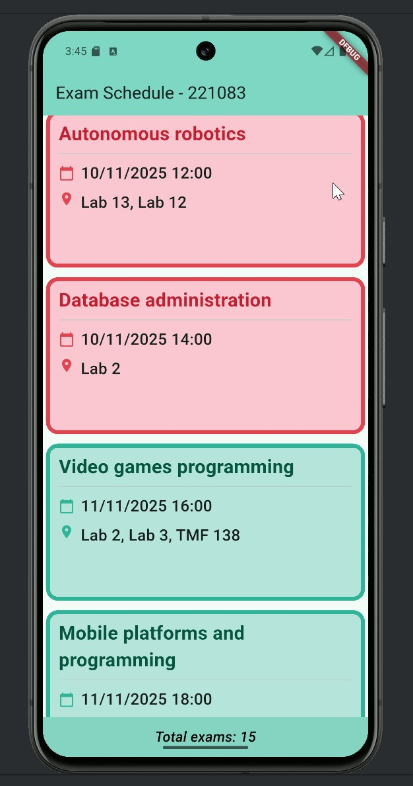
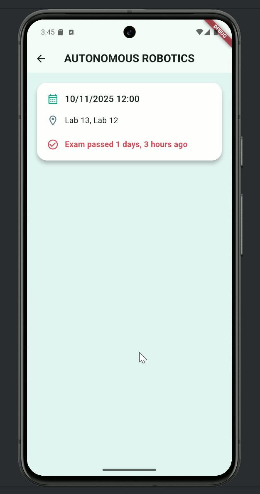
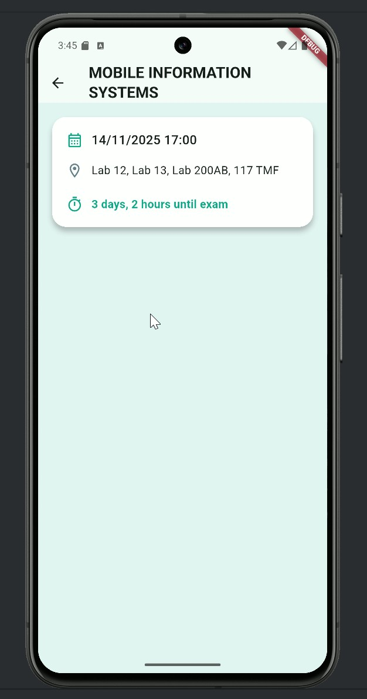

# Exam Schedule - Lab Exercise 1

A simple Flutter app that displays a schedule of exams. The app shows exams in chronological order with different colors for past and upcoming exams. Each exam can be opened for detailed information including remaining time until the exam.

## Features

- List of exams showing course name, date, time, and classrooms
- Different colors for past and upcoming exams
- Uses Card widgets for clean UI presentation
- Detailed screen for each exam showing remaining time ("X days, Y hours")
- Badge showing total number of exams

## Screenshots

### Home screen


### Exam details for a past exam


### Exam details for an upcoming exam


***

Video demonstration is available [here](demo/exam_schedule_demo.mp4)

***

## How to Run

1. Install Flutter SDK and a suitable IDE (Android Studio or VS Code)
2. Clone the repository
3. Run the following commands in the terminal:
```
flutter pub get
flutter run
```