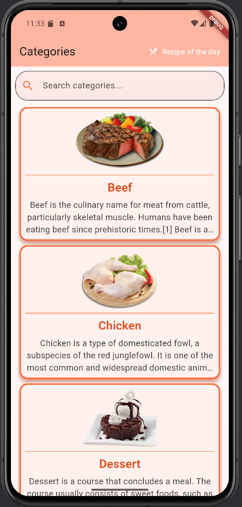
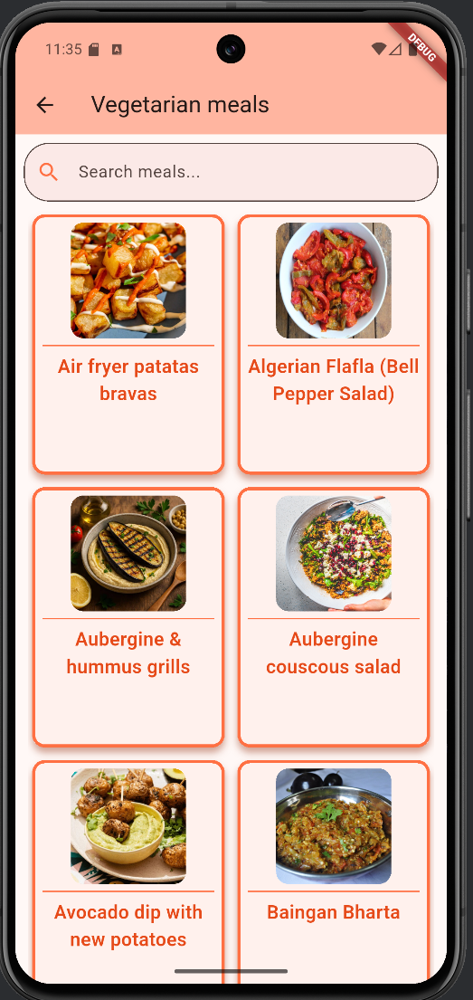
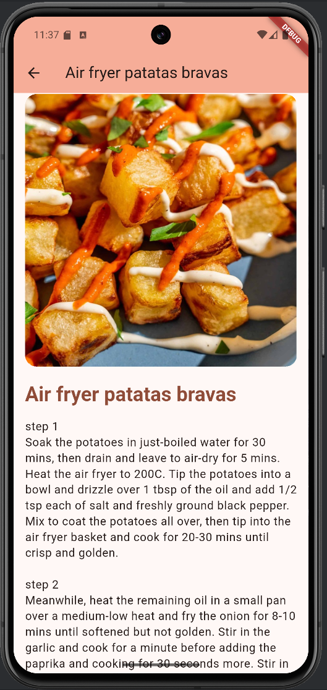
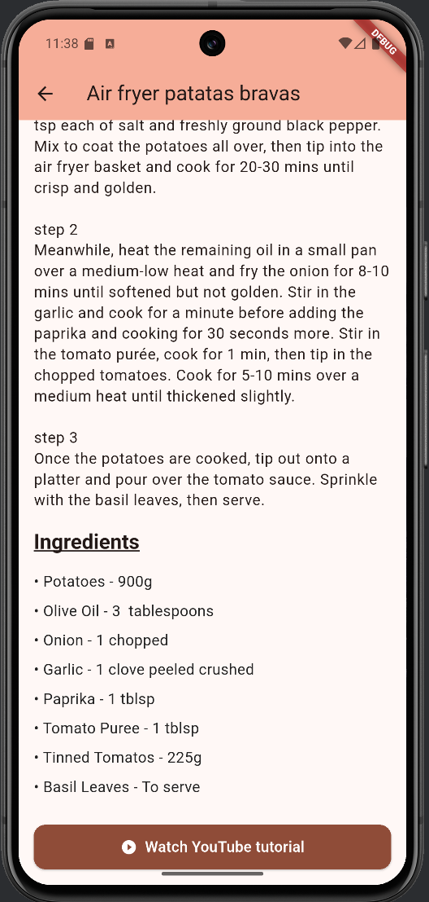

# Recipes App – Lab Exercise 2

A Flutter app that displays recipes from [TheMealDB](https://www.themealdb.com) API. The app shows meal categories, meals inside each category, and detailed recipes with ingredients, instructions, and a YouTube tutorial link.

## Features

- List of categories with images and descriptions
- Grid of meals for a selected category
- Search bar for filtering categories and meals by name
- Detailed recipe screen showing:
    - Meal image, name and full instructions
    - Structured list of ingredients with measures
    - Button to open a YouTube video tutorial for the recipe
- "Recipe of the day" button that loads a random recipe

## Screenshots

### Home screen


### Meals in a category


### Recipe details



***

Video demonstration is available [here](demo/themealdb_app_demo.mp4)

***

## How to Run

1. Install Flutter SDK and a suitable IDE (Android Studio or VS Code).
2. Clone the repository.
3. Navigate to the `laboratory_exercise_2` folder.
4. Run the following commands in the terminal:

```
flutter pub get
flutter run
```